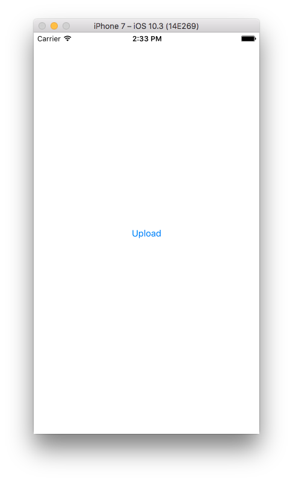

# 如何使用AWS SDK for iOS(swift-3)操作MinIO Server [](https://slack.min.io)

本文我们将学习如何使用`AWSS3` for iOS来操作MinIO Server。`AWSS3` for iOS是swift/objective-c语言版本的官方AWS SDK。

## 1. 前提条件

从[这里](https://docs.min.io/docs/minio-quickstart-guide)下载并安装MinIO Server。

如果想要最新版的`AWSS3` SDK v2.5.5能正常操作minio/minio:edge，你需要修改`AWSS3` SDK中的`AWSSignature.m`文件，删除这一行，`[urlRequest setValue:@"Chunked" forHTTPHeaderField:@"Transfer-Encoding"];`，请关注[aws-sdk-ios #638](https://github.com/aws/aws-sdk-ios/pull/638)。

## 2. 安装

从[AWS IOS SDK官方文档](http://docs.aws.amazon.com/mobile/sdkforios/developerguide/setup-aws-sdk-for-ios.html)中下载将安装`AWSS3` for iOS。

我们只需要'AWSS3'。

## 3. 示例

修改`accessKey`, `secretKey` 和 `url`，根据你的需求修改region， service必须设置成`.S3`。

（如果你在`url`中键入`xxxx:9000`，`AWSS3`会自动删除端口号，目前它只支持没有端口的URL，所以请确保你有一个到9000的域映射，你可能需要参考[如何给MinIO Server设置Nginx代理](https://docs.min.io/docs/setup-nginx-proxy-with-minio))

``` swift
let accessKey = "XXXXXXX"
let secretKey = "XXXXXXX"

let credentialsProvider = AWSStaticCredentialsProvider(accessKey: accessKey, secretKey: secretKey)
let configuration = AWSServiceConfiguration(region: .USEast1, endpoint: AWSEndpoint(region: .USEast1, service: .S3, url: URL(string:"XXXXXX")),credentialsProvider: credentialsProvider)

AWSServiceManager.default().defaultServiceConfiguration = configuration

let S3BucketName = "images"
let remoteName = "prefix_test.jpg"
let fileURL = URL(fileURLWithPath: NSTemporaryDirectory()).appendingPathComponent(remoteName)
let image = UIImage(named: "test")
let data = UIImageJPEGRepresentation(image!, 0.9)
do {
    try data?.write(to: fileURL)
}
catch {}

let uploadRequest = AWSS3TransferManagerUploadRequest()!
uploadRequest.body = fileURL
uploadRequest.key = remoteName
uploadRequest.bucket = S3BucketName
uploadRequest.contentType = "image/jpeg"
uploadRequest.acl = .publicRead

let transferManager = AWSS3TransferManager.default()

transferManager.upload(uploadRequest).continueWith { (task: AWSTask<AnyObject>) -> Any? in
  ...
}
```

[完整示例程序](https://github.com/atom2ueki/minio-ios-example)

## 4. 运行程序

例如，如果您运行该示例项目
1. 在手机或模拟器上运行xcode项目
2. 点击屏幕上的上传按钮



3. 通过`MinIO Browser`访问, 在images这个存储桶里,应该有一个叫prefix_test.jpg的文件，这就代表你成功了。 
