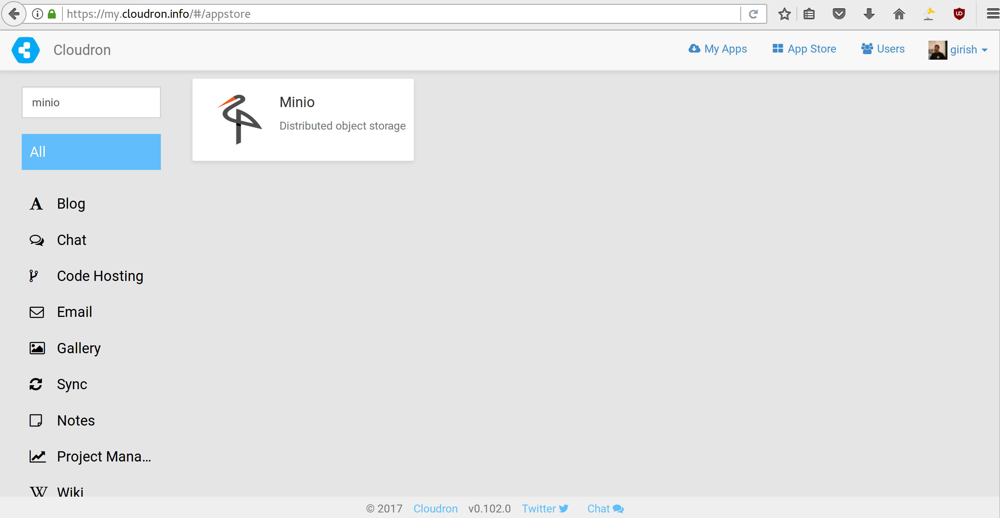
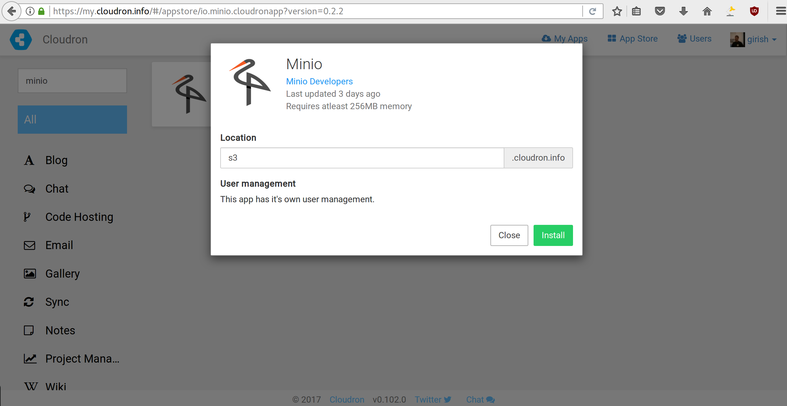
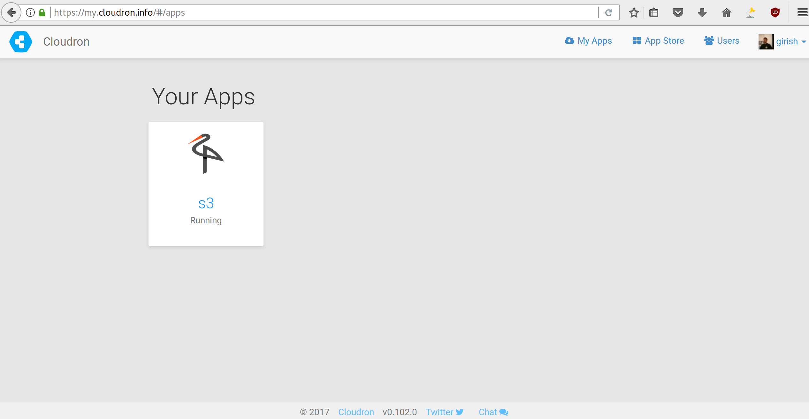
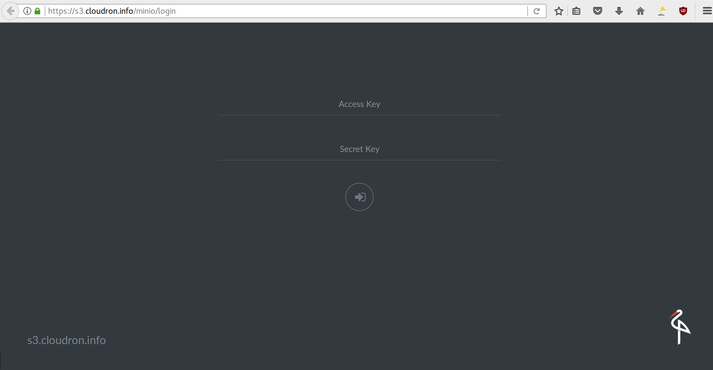

# 如何在Cloudron中运行MinIO 

[Cloudron](https://cloudron.io)是一个方便在你的服务器上运行和维护Web应用程序的平台。 

在本文中，我们将学习如何在Cloudron中运行MinIO。

## 1. 前提条件

* Cloudron已经安装并运行, 如果没有，请参考 [安装说明](https://cloudron.io/get.html#selfhost)。
* 如果你没有Cloudron,你可以在 [demo实例](https://my-demo.cloudron.me)练习。用户名和密码都是`cloudron`。

## 2. 安装步骤

### 从Cloudron App Store安装

到Cloudron App Store页面，搜索'MinIO'。

  

### 安装MinIO

安装对话框允许您输入要安装MinIO的任何子域。这里我们选择子域`s3`。

  

### 访问MinIO

单击安装的应用程序列表中的MinIO应用程序图标访问MinIO 。

  

### 结合Let's Encrypt运行MinIO

注意MinIO已经设置好了Let's Encrypt的证书，你可以用Access Key `admin`和Secret Key `secretkey`来访问MinIO。

  

