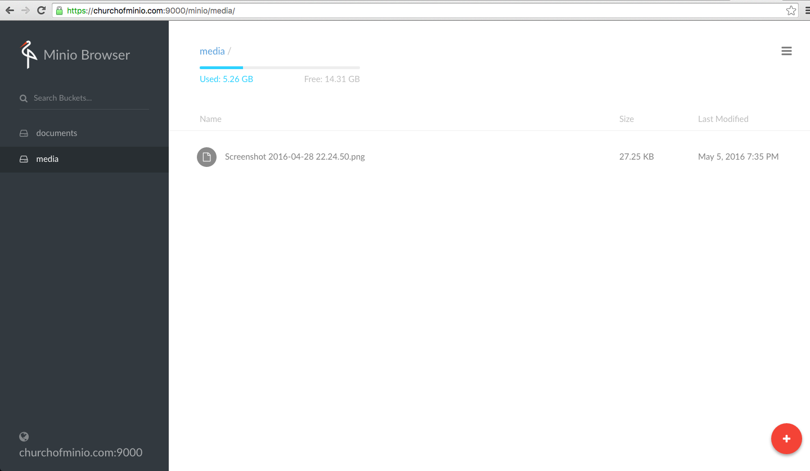

# Generate Let’s Encrypt certificate using Concert for Minio

[Let’s Encrypt ](https://letsencrypt.org/)is a new Certificate Authority: It’s free, automated, and open (Public Beta)

[Concert ](https://docs.minio.io/docs/concert) is a console based certificate generation tool for  Let’s Encrypt. It is open source & one of related project from Minio.

We are going to generate Let's Encypt certificate using Concert followed by consuming it with  Minio server.

## Prerequisites
* You have golang 1.6+ setup up and running, if not follow [this guide](https://docs.minio.io/docs/install-golang).
* Port 443 for https is open and  free at time of executing `concert`
* Concert will require root access while executing because only root is allowed to bind to any port below 1024.
* You have latest Minio server downloaded, if not please follow Minio Server [Quickstart Guide](doc:minio)
* We are using ``churchofminio.com`` domain name to generate let's encrypt certs for.

## Install Concert
```
$ go get -u github.com/minio/concert
```
## Generate Let's Encrypt cert
```
$ sudo concert gen --dir my-certs admin@churchofminio.com churchofminio.com
2016/04/04 07:10:01 Generated certificates for churchofminio.com under my-certs will expire in 89 days.
```
Now list your certs saved in `my-certs` directory
```
$ ls -l my-certs/
total 12
-rw------- 1 root root  227 Apr  4 07:10 certs.json
-rw------- 1 root root 1679 Apr  4 07:10 private.key
-rw------- 1 root root 3448 Apr  4 07:10 public.crt
```
## Setting up SSL for Minio server with Let's Encrypt

The generated keys via Concert needs to be placed inside users home directory ``${HOME}/.minio/certs``
```
$ sudo cp my-certs/private.key /home/supernova/.minio/certs/
$ sudo cp my-certs/public.crt /home/supernova/.minio/certs/
```
Change the ownership of certificates.
```
$ sudo chown supernova:supernova /home/supernova/.minio/certs/private.key
$ sudo chown supernova:supernova /home/supernova/.minio/certs/public.crt
```

After this all we need to do is to start Minio server, now you have HTTPS.
```
$ minio server export/
```
An example server with HTTPS is running at
``https://churchofminio.com:9000``


